## 计算机毕业设计Django+Vue.js知识图谱音乐推荐系统 音乐爬虫可视化 音乐数据分析 大数据毕设 大数据毕业设计 机器学习 深度学习 人工智能

## 要求
### 源码有偿！一套(论文 PPT 源码+sql脚本+教程)

### 
### 加好友前帮忙start一下，并备注github有偿纯python图谱音乐推荐
### 我的QQ号是2827724252或者798059319或者 1679232425或者微信:bysj2023nb 或bysj1688

# 

### 加qq好友说明（被部分 网友整得心力交瘁）：
    1.加好友务必按照格式备注
    2.避免浪费各自的时间！
    3.当“客服”不容易，repo 主是体面人，不爆粗，性格好，文明人。

### 功能
#### 精心设计的 neo4j 知识图谱功能
#### 前台用户：注册、登录、搜索音乐、信息修改、密码修改、音乐评分、个性化推荐音乐（基于用户的协同过滤）
#### 后台管理员：用户管理，音乐管理、歌手管理、评分管理、管理员管理、自定义权限
#### 个性化推荐功能： 根据用户评分记录，使用基于用户的协同过滤算法推荐音乐
#### 超强可视化功能！ 音乐数据：通过爬取豆瓣音乐数据 Echarts 音乐可视化分析！

### 演示视频
https://www.bilibili.com/video/BV1bz421i7zB/?spm_id_from=333.999.0.0

### 截图

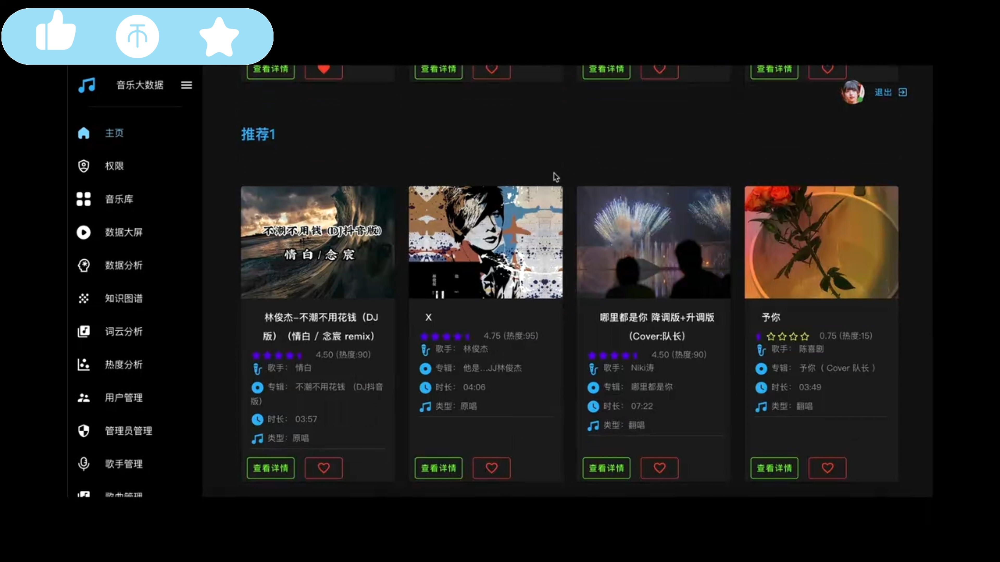
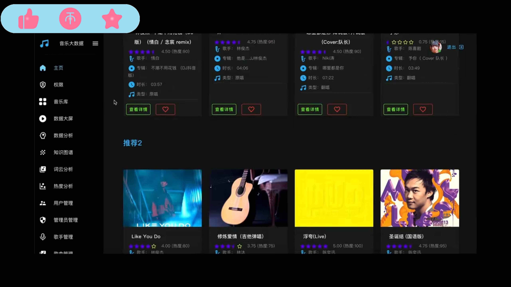
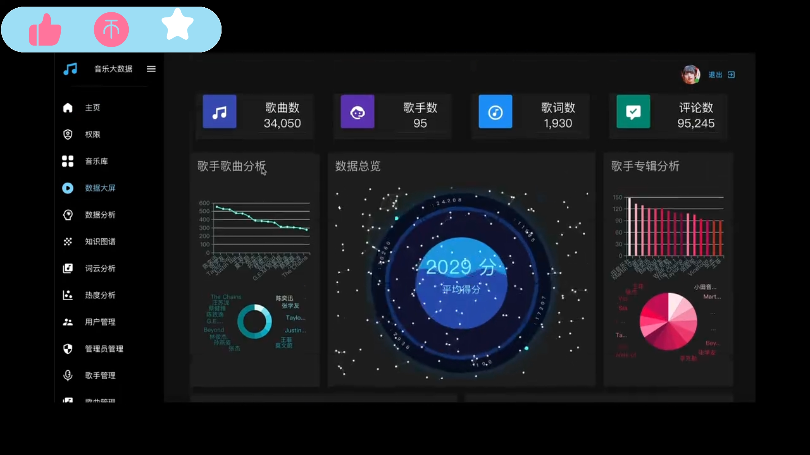
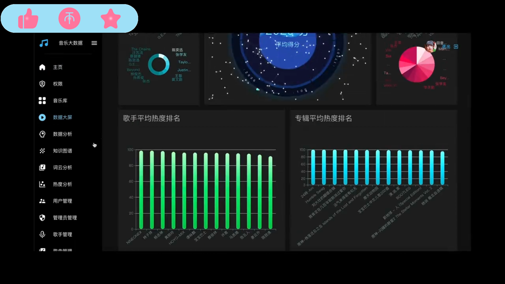
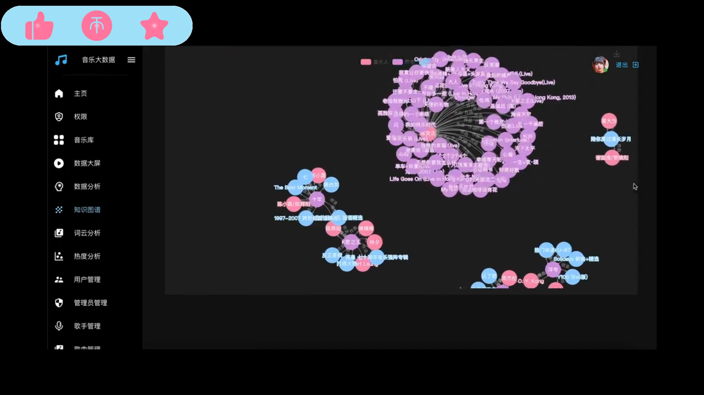
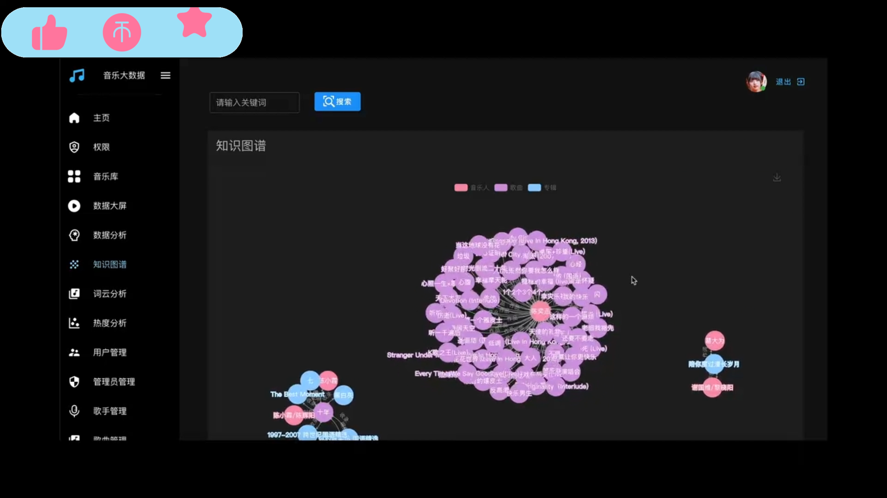
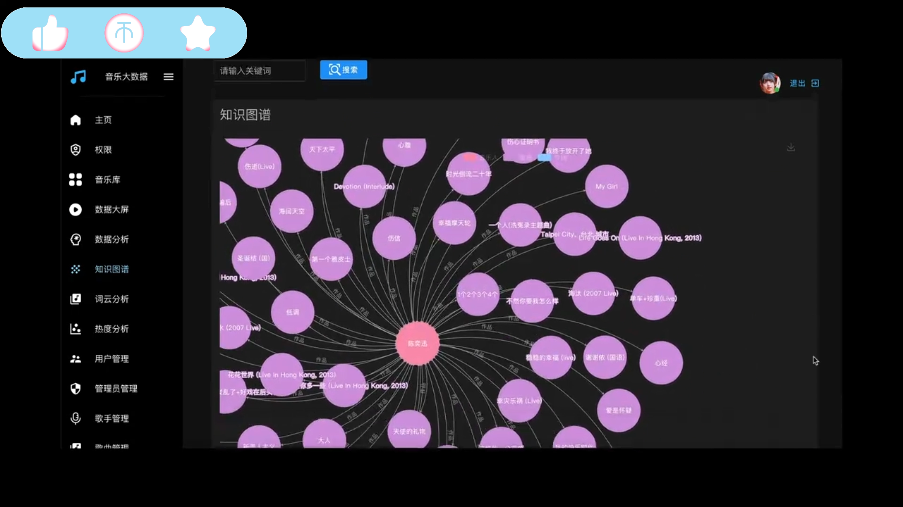
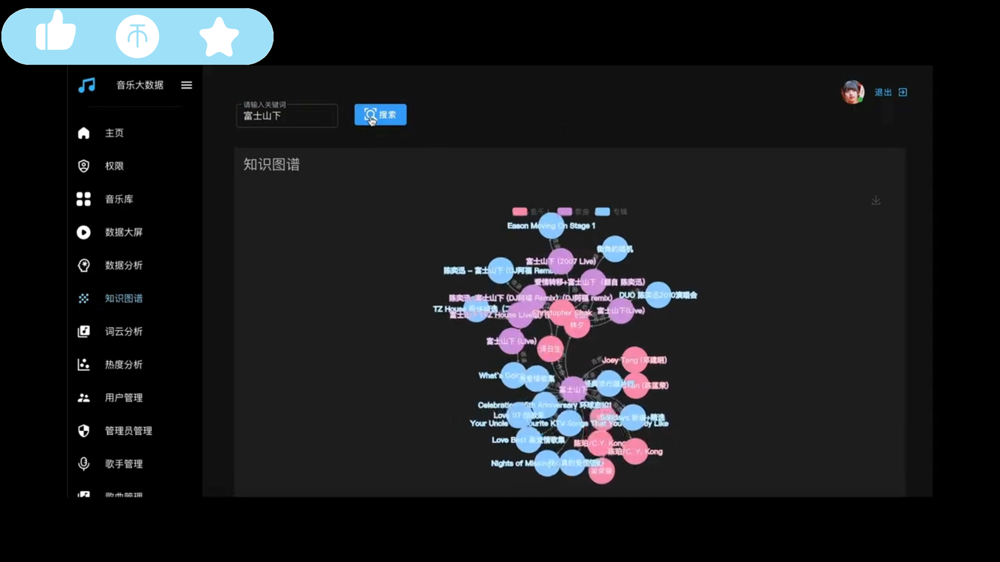
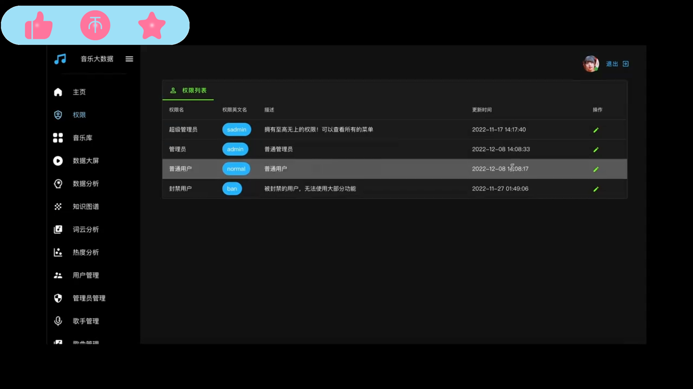
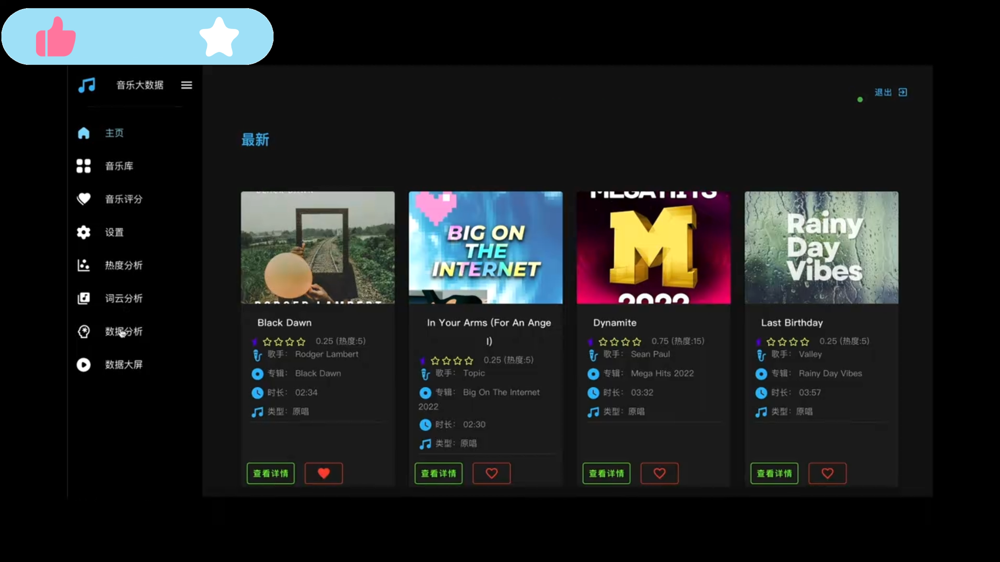
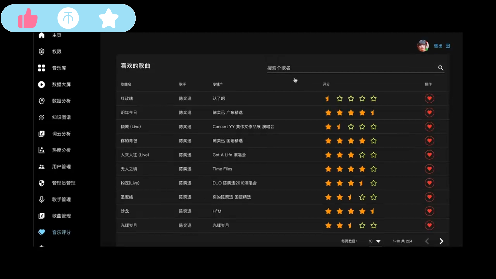
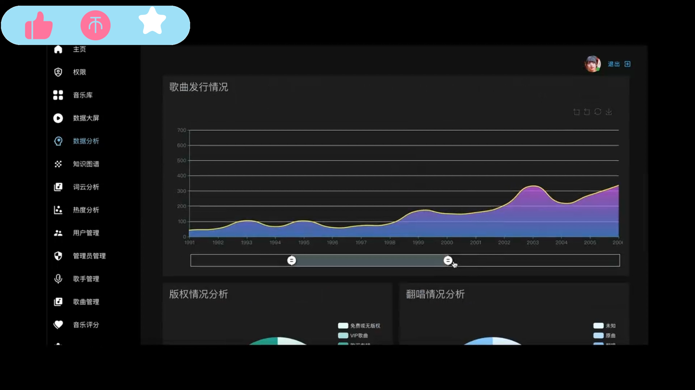
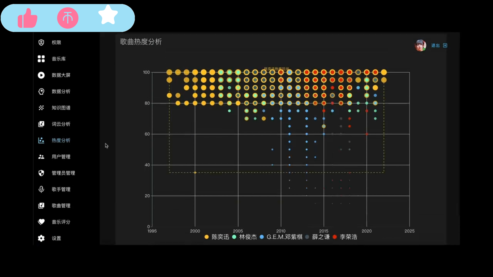
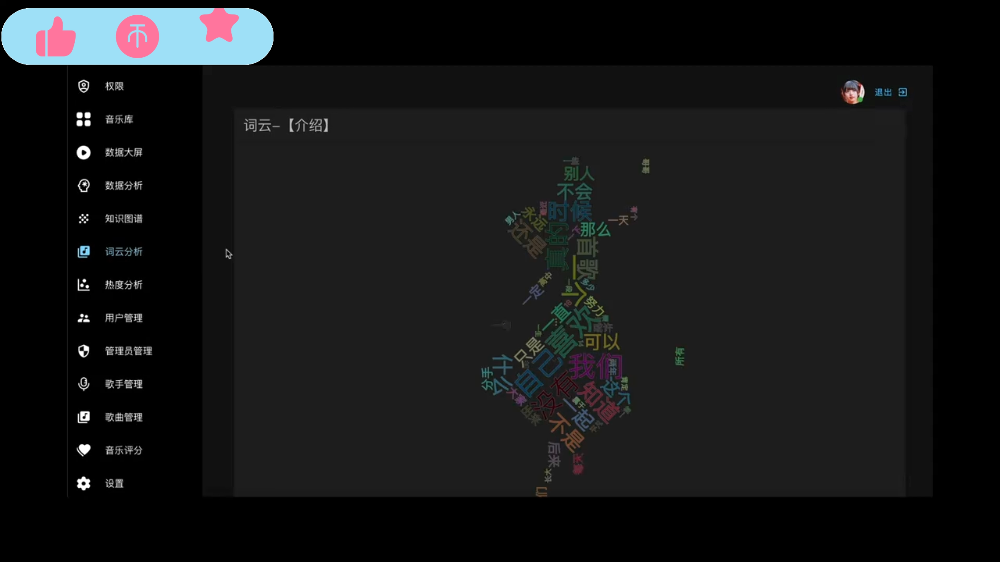

